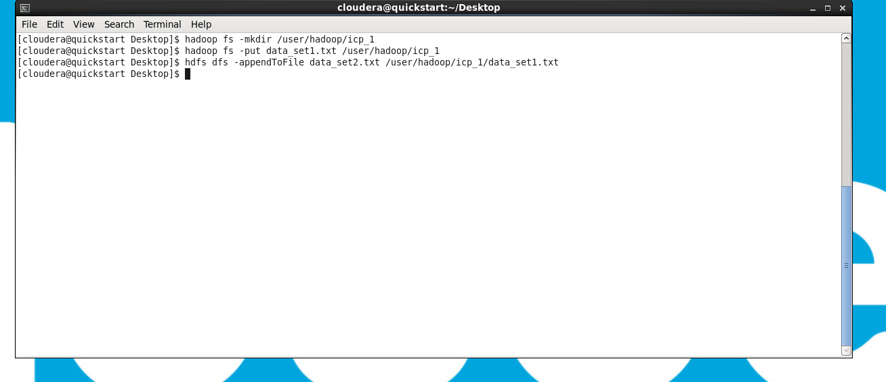

# ICP 1 - Installation and intro to hadoop

## Task 1 - Load first dataset into hadoop

In order to move the first dataset file to hadoop, I first used the 'mkdir' command to create a new directory on the hadoop instance under /user/hadoop/icp_1. I then, via the 'put' command, moved the dataset1.txt file from the local desktop to the hadoop directory I just created.

## Task 2 - Append dataset 2 to dataset 1 in hadoop

Appending the second data set to the first one is fairly straightforward. Using the command 'appendToFile' the contents of data_file2.txt were copied over and appended to the data_set1.txt file located in /user/hadoop/icp_1 on the hadoop instance.

## Task 3 - Visualize the file with HUE

After locating the HUE web-app in the browser, I was able to use it to view the Hadoop instance's file system and navigate to the dataset file. The screenshot above depicts pages 1 through 50 of the dataset.

## Task 4 - View the first and last lines of the hadoop file

hdfs commands are similar to that of standard linux/unix system commands; Therefore, a simple 'cat' command was all that was needed to view the contents of the file on the hadoop instance. Piping the output to both the 'head' and 'tail' commands gave us the first and last few lines of the file. I used the argument '-n 5' to specify that I wanted 5 lines to be returned by the head and tail commands.

## Task 5 - Load new text file into hadoop and append all three files together

using vi, I created a new file on the local machine, then used the same commands from task 2 to append all three of the datasets together
